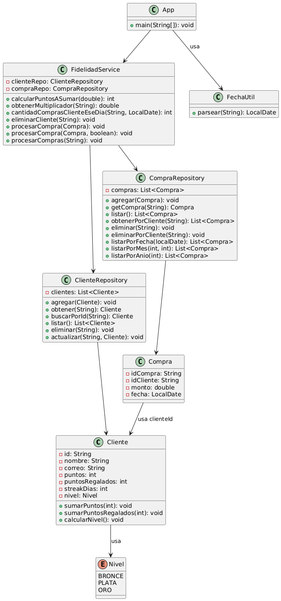

# Sistema de Fidelización de Clientes

Este proyecto es una aplicación de consola en Java que permite gestionar un sistema de fidelización de clientes, registrando compras, sumando puntos, niveles y bonus por frecuencia.

Cada $100 comprados por un cliente, este recibe 1 punto (redondeado hacia abajo), este puede contar con los siguiente niveles para obtener estos benefecios:
- Bronce: 0-499 puntos, no hay beneficio
- Plata:500-1500 puntos, recibe +20 % puntos
- Oro:1500-2999 puntos, recibe +50 % puntos
- Platino:3000+ puntos, recibe +100 % puntos

Además, si un cliente realiza 3 compras en un mismo dia, recibe 10 puntos adicionales.

Supuestos:
- El bonus de 3 compras en un dia también se ve beneficado por su nivel.
- Un cliente puede empezar con una determinada cantidad de puntos y el usuario tiene libertad para sumarle o restarle más si es que quiere, pero nunca podrá tener menos de los puntos que ha conseguido por sus compras.
- Si se elimina una compra o se realiza una con una fecha pasada, se recalcularán todos sus puntos en base a las reglas establecidas previamente, por orden de compras realizadas. 
---

## 🧱 Diseño

El sistema está organizado según el estilo de diseño orientado a objetos. Las clases son:

- `Cliente`: contiene los datos del cliente y lógica para sumar puntos y calcular su respectivo nivel.
- `Compra`: representa una compra con monto y fecha.
- `ClienteRepository` / `CompraRepository`: gestionan la persistencia en memoria.
- `FidelidadService`: lógica de negocio.
- `App`: clase principal que permite al usuario interactuar desde la consola.
- `FechaUtil`: Se encarga de transformar las fechas ingresadas a una variable tipo LocalDate.

## 📐 Diagrama de Clases UML




### ✅ Suite de Tests (JUnit 5)

Se usó **JUnit 5** con assertions estándar para cubrir la lógica del sistema, incluyendo:

- **`FidelidadService`**:
  - Suma de puntos según el monto de la compra.
  - Bonificación por tercera compra del mismo día.
  - Reprocesamiento de puntos de compras anteriores.
  - Manejo de casos de error (clientes no existentes, compras inválidas, etc.).

- **`Cliente`**:
  - Acumulación de puntos.
  - Cálculo del nivel de fidelidad (`BRONCE`, `PLATA`, `ORO`).
  - Registro de puntos regalados y racha de compras.

- **`CompraRepository`** y **`ClienteRepository`**:
  - Agregado, búsqueda, actualización y eliminación de entidades en memoria.
  - Filtrado por cliente, fecha, mes y año.

> La única clase no cubierta por pruebas es `App`, ya que gestiona la interacción por consola (CLI).

## 🛠️ Instrucciones para compilar, testear y ejecutar

### ✅ Requisitos previos

- Java 21 o superior
- Maven 3.10
- VSCode, IntelliJ u otro IDE Java (opcional)

### ⚙️ Compilar y ejecutar pruebas

Desde la carpeta raíz del proyecto, puedes usar los siguientes comandos:

#### 🔹 Compilar el proyecto
```bash
mvn clean compile
```
#### 🔹 Ejecutar las pruebas y compilar
```bash
mvn clean compile
```
#### 🔹 Generar el reporte de cobertura con JaCoCo
```bash
mvn jacoco:report
```
#### 🔹 Ejecutar todo junto (compilación, tests y reporte)
```bash
mvn clean test jacoco:report
```
#### 🔹 Ver el reporte de cobertura
Abre el siguiente archivo en tu navegador:
```bash
target/site/jacoco/index.html
```
O si estás en Windows, ejecuta:
```bash
start target\site\jacoco\index.html
```
#### 🔹 Ejecutar la aplicación (modo consola)
```bash
mvn exec:java
```

### Ejemplo de salida (VSCode o consola):
```bash
[INFO] -------------------------------------------------------
[INFO]  T E S T S
[INFO] -------------------------------------------------------
[INFO] Running com.fidelidad.modelo.ClienteTest
[INFO] Tests run: 39, Failures: 0, Errors: 0, Skipped: 0, Time elapsed: 0.331 s -- in com.fidelidad.modelo.ClienteTest
[INFO] Running com.fidelidad.modelo.CompraTest
[INFO] Tests run: 8, Failures: 0, Errors: 0, Skipped: 0, Time elapsed: 0.050 s -- in com.fidelidad.modelo.CompraTest
[INFO] Running com.fidelidad.modelo.NivelTest
[INFO] Tests run: 2, Failures: 0, Errors: 0, Skipped: 0, Time elapsed: 0.015 s -- in com.fidelidad.modelo.NivelTest
[INFO] Running com.fidelidad.repositories.ClienteRepositoryTest
[INFO] Tests run: 11, Failures: 0, Errors: 0, Skipped: 0, Time elapsed: 0.085 s -- in com.fidelidad.repositories.ClienteRepositoryTest
[INFO] Running com.fidelidad.repositories.CompraRepositoryTest
[INFO] Tests run: 18, Failures: 0, Errors: 0, Skipped: 0, Time elapsed: 0.072 s -- in com.fidelidad.repositories.CompraRepositoryTest
[INFO] Running com.fidelidad.services.FidelidadServiceTest
[INFO] Tests run: 14, Failures: 0, Errors: 0, Skipped: 0, Time elapsed: 0.082 s -- in com.fidelidad.services.FidelidadServiceTest
[INFO] Running com.fidelidad.util.FechaUtilTest
[INFO] Tests run: 4, Failures: 0, Errors: 0, Skipped: 0, Time elapsed: 0.043 s -- in com.fidelidad.util.FechaUtilTest
[INFO] 
[INFO] Results:
[INFO]
[INFO] Tests run: 96, Failures: 0, Errors: 0, Skipped: 0
[INFO]
[INFO]
[INFO] --- jacoco:0.8.10:report (report) @ programa-fidelidad ---
[INFO] Loading execution data file C:\Users\ssjor\OneDrive\Documentos\aaaguardar\ZPRURBASDESW\tarea3\programa-fidelidad\target\jacoco.exec
[INFO] Analyzed bundle 'programa-fidelidad' with 7 classes
[INFO] 
[INFO] --- jacoco:0.8.10:report (default-cli) @ programa-fidelidad ---
[INFO] Loading execution data file C:\Users\ssjor\OneDrive\Documentos\aaaguardar\ZPRURBASDESW\tarea3\programa-fidelidad\target\jacoco.exec       
[INFO] Analyzed bundle 'programa-fidelidad' with 7 classes
[INFO] ------------------------------------------------------------------------
[INFO] BUILD SUCCESS
[INFO] ------------------------------------------------------------------------
[INFO] Total time:  19.410 s
[INFO] Finished at: 2025-07-08T23:15:16-04:00
[INFO] ------------------------------------------------------------------------
```

## 📊 Cobertura de Código

Se usó **JaCoCo** a través del plugin Maven `jacoco-maven-plugin`. La cobertura medida es:

**Cobertura de instrucciones y ramas (branch + line coverage)**  
✅ Esto permite detectar si se prueban tanto condiciones verdaderas como falsas, además de líneas ejecutadas.

> **¿Por qué?** Porque asegura que todas las rutas posibles en los métodos son ejecutadas al menos una vez.

---


Este proyecto está licenciado bajo la licencia MIT (ver archivo LICENSE).

Consideraciones

La persistencia es en memoria (no se guarda en archivos).

Todos los datos se pierden al cerrar la aplicación.

Se usó programación orientada a objetos limpia, dividiendo entidades, lógica de negocio y persistencia.

